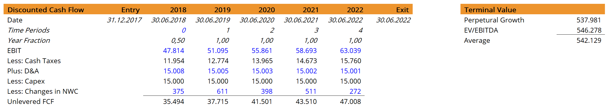
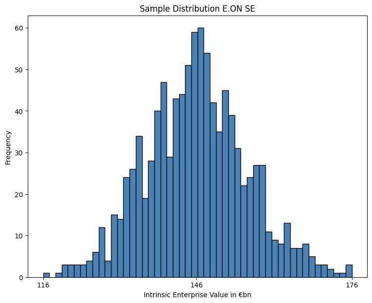

# Building a Corporate Valuation Model with Python

I will build a corporate valuation model identical to the methods given in [Brigham & Houston ("Fundamentals of Financial Management", 6th ed., 2009, South Western Cengage Learning, pp. 288 and pp. 306)](https://www.valorebooks.com/textbooks/fundamentals-of-financial-management-concise-edition-with-thomson-one-business-school-edition-6th-edition/9780324664553). Additionally, one can check the [this source](https://corporatefinanceinstitute.com/resources/knowledge/modeling/dcf-model-training-free-guide/), too, for further insights on the topic of corporate valuation.

## Set up PostgreSQL Database to store Financial Information

To set up the database we will use **sqlalchemy**, **PostgreSQL** and **Psycopg2** as driver and build the model similar to the approach given in [this article](https://www.pythonforfinance.net/2020/10/24/build-a-financial-data-database-with-python/). We will create several tables in order to store the financial statement data from the `Financial Modeling Prep API`, which offers quite well-curated and broad data. With each run we can append the most recent data and so build up a historical database. If we establish a database we can store the data values and so - going forward - extend the data continuously. As we will see this will require a workaround with several SQL statements and tables. 

Specifically, we will build 'backup' temporary tables into which we simply insert the data with each new run and then store the new data - as identified with the id-column and the date-column - in the standard tables. So each statement table is identified by a **combined Primary Key (id, date)**. Note that after the comparison of the new data in the temporary tables with the given data in the standard tables we might have some duplicate values in the **id column** of each standard table, which would usually not be allowed in the case of single Primary Keys - however, in combination with each **date** each row will be uniquely identified. 

Thus, the `insert_new_data()` function will check whether (id, date)-value pairs are already existent in the standard table and insert only those rows from the temporary table which are not yet existent, given the respective (id, date)-value pair.

We will first add the necessary packages and setup an engine object as 'medium' for database communication with Postgres. Then, we will define the **standard tables**. The **temporary tables** will be setup identically to the standard tables. Hence, we will have four standard tables + four temporary tables in the following structure:

   - Table "company", with `shortName`, `symbol`, `sector`, `industry`, `currency` and `exchange shortname` as attributes (identical to the yfinance API keys)
   - Table "balanceSheet", with  **primary key `(id, date)`** and **foreign key `company_id`**
   - Table "incomeStatement", with **primary key `(id, date)`** and **foreign key `company_id`**
   - Table "cashflowStatement", with **primary key `(id, date)`** and **foreign key `company_id`**

I use **PgAdmin 4** as a (visual) database management tool.

### Connect to the Database & Build the Basic Database Structure

In order to connect with any Database management system, it is essential to create an engine object, that serves as a central source of connection by providing a connection pool that manages the database connections. This SQLAlchemy engine is a global object which can be created and configured once and use the same engine object multiple times for different operations.

The first step in establishing a connection with the PostgreSQL database is creating an engine object using the create_engine() function of SQLAlchemy.

## Get Company Data & Store it into the Database

As the `yahoo finance API` is constantly throwing errors and does not deliver well-curated fundamental financial data I switch to [Financial Modeling Prep](https://site.financialmodelingprep.com/) as the new data source for the financials I need. I created an account with a 10.50 bill per month which is really affordable. The documentation is well-structured and quite straightforward.

### Create Temporary Tables and Insert the Data

As we cannot use `to_sql()` in order to append only the new data which we retrieved from the yahoo finance API, we need to insert **temporary tables** in which we simply append with `to_sql()` all the obtained data from each run and then insert with a `WHERE` statement comparison only the new data into the **'original' standard tables**.

The `to_sql()` method of pandas does not check with its `if_exists` parameter whether each row already exists, but instead checks whether the table already exists. If the table exists, `to_sql()` either replaces the whole table OR simply appends each new dataframe from each run of this script such that we get a duplicate error, since the structure of the yahoo finance statements is always the same.

I follow [this article](https://stackoverflow.com/questions/63992639/pandas-to-sql-append-vs-replace) on _stackoverflow_ to construct and execute the necessary SQL query.

So, once we have the temp tables created, we should then always upload the data we collected with each run from the `Financial Modeling API` into those tables and later on copy these values with a specific function called `insert_new_data()` (see below!) into the 'original' standard tables.

---

## DCF Method for Valuation

Having established the database, I will build a corporate valuation model identical to the methods given in [Brigham & Houston ("Fundamentals of Financial Management", 6th ed., 2009, South Western Cengage Learning, pp. 288 and pp. 306)](https://www.valorebooks.com/textbooks/fundamentals-of-financial-management-concise-edition-with-thomson-one-business-school-edition-6th-edition/9780324664553). Additionally, one can check the [this source](https://corporatefinanceinstitute.com/resources/knowledge/modeling/dcf-model-training-free-guide/), too, for further insights on the topic of corporate valuation.

Before starting the analysis we need some general assumptions and information on data in order to implement the DCF method for company valuation. We need the _after-tax cost of debt_ for the specific company as well as the _cost of its equity_. As for the debt it is quite cumbersome to get the individual firm´s cost of debt - either we would need to check the annual reports of that company or be lucky and find a free platform that offers such an information for any possible company. Both methods are difficult to implement in a dynamic and automated manner within a python script; I would need to build an extra scraper just to retrieve such an information for any possible firm. And I barely believe that there is a free source for that.

<u><h4>Cost of Debt Estimate</h4></u>

Hence, I will **use the [central bank information on interest rates](https://sdw.ecb.europa.eu/browse.do?node=bbn2883) of new loans (>1 EURm) for non-financial corporations** and retrieve interest rate time series data from the `ECB SDM 2.1 RESTful web service` through making a **http get request**. Basically, it is like a function replicating the [sdw_api python package from the ECB](https://pypi.org/project/sdw-api/), but is more flexible in the sense that it does not throw an error for the retrieved data if different time series are imported, which was the case for the api package.

The standard entrypoint for the **ECB SDMX 2.1 RESTful web service** is `https://sdw-wsrest.ecb.europa.eu/service/data/`. 
We then make an empty list in which we will store each individual dataframe which we will have received from the https get request on basis of the time series keys in 'keys_list'. Specifically, I will use the **key 'MIR.M.U2.B.A2A.O.R.1.2240.EUR.N'** which identifies the data on `Bank interest rates - loans to corporations of over EUR 1M with an IRF period of over five & up to ten years (new business) - euro area`. Nonetheless, I will write a function that is general enough to iterate across a list of keys and get an average estimate of the interest rate level.

In essence, the function `get_ir_data()` is general enough in order to retrieve ECB data for any key in the `key_list` (e.g. also keys for the yield curve or exchange rates).

<u><h4>Cost of Equity Estimate</h4></u>

As for the cost of equity I will follow the <b>CAPM Approach</b>, i.e. use the current ECB interest rate for main refinancing operations (1.25%, 2022/09/17) as **risk-free rate** and calculate the **annualized market risk premium** from the historical price data of the respective stock index. The **beta coefficient** of the individual company is retrieved from the `FMP API` while we use `YahooFinancials API` for **historical price data of the respective index**.

### Build the Forecast Model

For revenues and EBIT we use CAGRs and the mean growth rate, respectively, in our model. For the other time series such as D&A, Capex, etc. we use an ARIMA Model from the `statsmodels API` to calculate the **unlevered Free-Cashflow-to-the-Firm** for each future year.  We do average between a terminal Enterprise Value based on an EV/EBITDA multiple and a Terminal Value that is based on a perpetual growth rate.

- As for the `perpetual (long-term growth rate)` to calculate the **terminal value** I use a 'tunable' variable, called `g`, which is based on the **long-term real GDP Growth** for the respective market as obtained from the **IMF API https://datahelp.imf.org/knowledgebase/articles/667681-using-json-restful-web-service**

- For 'EBIT' we use `operatingIncomeRatio` from the Income Statement as delivered by FMP and the related average over the last available years and apply it on the extrapolated revenues.

- For 'Cash Taxes' in order to calculate `NOPAT (Net Operating Profit After Tax)` we use the defined tax rate of _15%_ of the German Tax system

- For 'D&A' we use `depreciationAndAmortization` as given in the Income Statement data of FMP, for 'Capex' we use `capitalExpenditure` and for 'Changes in Net Working Capital' we use `changeInWorkingCapital` from the CF Statement as delivered by FMP as a rough estimate.

Additionally, we extract the **net debt value** as given by `FMP` for the current fiscal year in order to calculate the **intrinsic Enterprise Value**.

#### Calculation Method

We calculate the unlevered FCF as follows. Please find the picture below:

As for the perpetual growth rate method, the terminal value is calculated as follows:

> $uFCF_T*(1+g)/(WACC-g)$

where $g$ is the long-term growth rate (perpetual growth rate) and $uFCF_T$ is the last period uFCF.

### Run Monte Carlo Simulation

Finally, we run a Monte Carlo Simulation across various input variables such as `revenue cagr`, `Operating Income Margin`, `long-term growth rate` and the `WACC`.

---

## Web Application for Stock Assessment

Finally, I build a web application with `Dash/Plotly` adding the final **stochastic Monte-Carlo Corporate Valuation Chart**, an overview of the chosen company from a dropdown and a candlestick chart which allows for adding a **simple moving average**, **exponential moving average** XOR **Bollinger Bands**. Moreover, a carousel is hovering on the top of the page for the collected Stocks.

OPEN TODO: Add a datatable with various financial KPIs on the bottom right.

## PyInstaller to wrap it into an .exe file

tbd...
